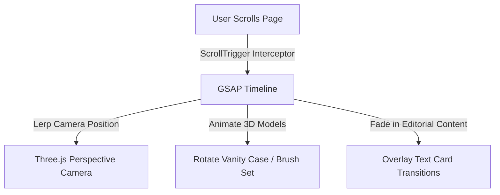

# 💄 Delhi Premium Bridal Makeup: 3D Scrollytelling Showcase

A premium, scroll-driven 3D interactive portfolio site showcasing luxury bridal makeup artistry and services in Delhi. This application pairs vanilla Three.js WebGL graphics with GSAP (GreenSock Animation Platform) scroll-handling to create an immersive, editorial scrollytelling experience.

---

## 🛠️ Technology Stack

- **Bundler & Build Tool**: Vite (Vanilla JS or React environment)
- **3D Graphics Engine**: Three.js (WebGL rendering)
- **Animation Systems**: GSAP (GreenSock) & GSAP ScrollTrigger
- **Styling**: Tailwind CSS / Custom CSS variables
- **Modeling Formats**: GLTF/GLB models, DRACO decompression

---

## 🎨 Interactive Storytelling Scenes

As the user scrolls down the landing page, the camera navigates a virtual 3D scene:



### Core WebGL Interactions

1. **Scene 1: The Vanity Showcase (Hero)**: A high-fidelity 3D model of a bridal vanity case rotates and opens in response to scroll progression, revealing premium makeup palettes.
2. **Scene 2: Bridal Palette Sandbox (Interactive)**: Users can interact with 3D color palettes to view real-time shade swatches and lighting profiles matching traditional Delhi bridal aesthetics (Traditional Crimson, Pastel Mint, Cocktail Glam).
3. **Scene 3: Virtual Consult (Footer)**: A clean, minimalist scheduling console overlays a rotating 3D bridal jewelry mesh.

---

## 📂 Proposed Codebase Directory Structure

```text
delhi-premium-bridal-makeup/
├── public/
│   ├── models/                # 3D assets (.gltf, .glb files)
│   │   └── vanity_case.glb    # Optimized vanity model
│   └── textures/              # Metalness, roughness, and normal maps
├── src/
│   ├── css/
│   │   └── styles.css         # Typography, layout, and canvas styling
│   ├── js/
│   │   ├── scene.js           # Three.js canvas setup, lightings, and render loop
│   │   ├── animations.js      # GSAP ScrollTrigger timeline definitions
│   │   └── main.js            # App entry, resize listener, and DOM binding
│   └── index.html             # Landing page layout & editorial copy overlays
├── package.json               # Node dependency declarations
└── README.md                  # Project documentation (this file)
```

---

## ⚡ Quickstart Commands

### 1. Installation
Ensure Node.js is installed. In the root directory, run:
```bash
npm install
```

### 2. Run Local Development Server
```bash
npm run dev
```
*The local development server launches at `http://localhost:5173`.*

### 3. Production Build
Optimize scripts and assets for production deployment:
```bash
npm run build
npm run preview
```

---

## 🤖 AI Developer Notes

### Context & Second Brain Mapping
- **Second Brain Notes**: Review active tasks and preferences under:
  [Ctx - delhi-premium-bridal-makeup Context](file:///home/deu/Documents/Technical%20&%20Academins/10%20AI/Context/Coding%20Repos/delhi-premium-bridal-makeup/Ctx%20-%20delhi-premium-bridal-makeup%20Context.md) and [Ctx - delhi-premium-bridal-makeup Inbox](file:///home/deu/Documents/Technical%20&%20Academins/10%20AI/Context/Coding%20Repos/delhi-premium-bridal-makeup/Ctx%20-%20delhi-premium-bridal-makeup%20Inbox.md).

### Codebase Invariants
- **WebGL Frame Performance**: Keep render loops clean. Avoid creating new vectors or materials inside the `requestAnimationFrame` callback.
- **GSAP ScrollTrigger Invariant**: Always initialize Three.js camera position changes using GSAP's `scrub` option rather than raw scroll event triggers. This ensures fluid interpolation (lerp) on high-refresh rate displays.
- **Asset Size Limitation**: All GLB models must be run through optimization sweeps (such as `gltf-pipeline` or Draco compression) to keep asset weights below **4MB** for mobile performance in Delhi cellular networks.
- **Canvas Resize**: The resize hook in `main.js` must update the camera's aspect ratio, trigger `camera.updateProjectionMatrix()`, and set the renderer pixel ratio dynamically:
  ```javascript
  renderer.setPixelRatio(Math.min(window.devicePixelRatio, 2));
  ```
